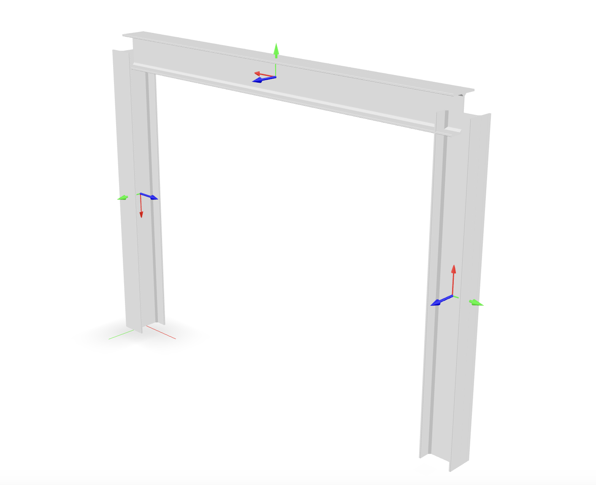

<!--  -->

The objective of this example is to demonstrate how to orient beam elements in 3D space. 
The model we'll build is a simple 3-element portal frame with wide-flange sections. 
Only certain relevant pieces of code will be shown in detail, but the full example script can
be downloaded from the link above.
We'll build two variations of the model; one where the 2nd coordinate is vertical, and another
with the 3rd coordinate vertical.
For the first case with \(X_2\) vertical we have:
```python
model.node(1, (    0,      0, 0))
model.node(2, (width,      0, 0))
model.node(3, (width, height, 0))
model.node(4, (    0, height, 0))

model.geomTransf("Linear", 1, (1, 0, 0))
model.geomTransf("Linear", 2, (0, 1, 0))
model.geomTransf("Linear", 3, (0, 0, 1))
```
and for \(X_3\) vertical:
```python
model.node(1, (    0, 0,      0))
model.node(2, (width, 0,      0))
model.node(3, (width, 0, height))
model.node(4, (    0, 0, height))

model.geomTransf("Linear", 1, (1, 0, 0))
model.geomTransf("Linear", 2, (0, 0, 1))
model.geomTransf("Linear", 3, (0,-1, 0))
```
Everything else is identical for both cases. The material is a simple
*ElasticIsotropic* model and for the section we'll use the `shps` package
to build a fiber discretization of a wide-flange:

```python
model.material("ElasticIsotropic", 1, 29e3, 0.3)

shape = WideFlange(d=8*inch, b=6.5*inch, tw=0.5*inch, tf=0.5*inch)
model.section("ShearFiber", 1)
for fiber in shape.create_fibers(origin="centroid"):
    model.fiber(**fiber, material=1, section=1)
```
