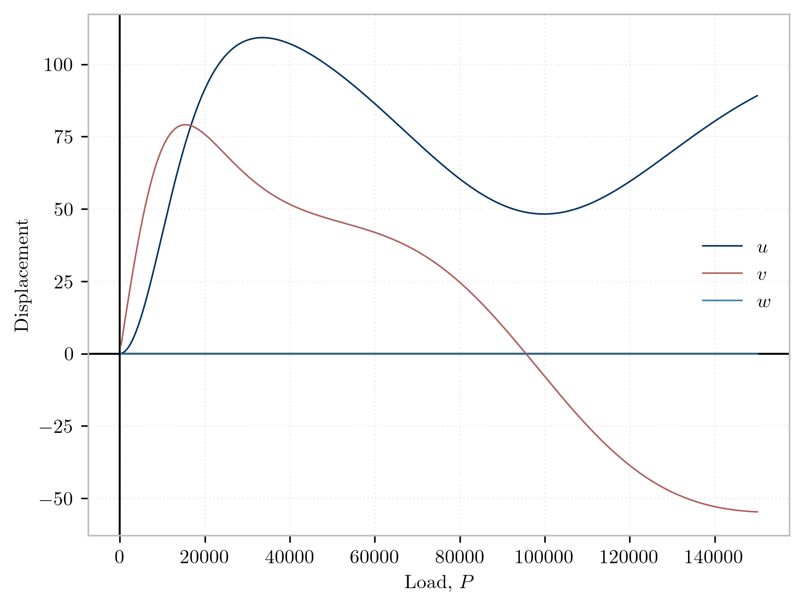

This example demonstrates the simulation of *follower loading* applied to frame elements.
Our model is a basic cantilever composed of `ne`, `ExactFrame` elements.

In order to define the follower loading, we first add a [`Plain`](https://opensees.stairlab.io/user/manual/model/pattern/plainPattern.html)
load pattern to the current [`Model`](https://opensees.stairlab.io/user/manual/model/model_class.html) instance,
labeled with the tag `1` and scaled in time by a `Linear` time series:

```python
    model.pattern("Plain", 1, "Linear")
```

Next we add a [`FrameLoad`](https://opensees.stairlab.io/user/manual/model/elements/frame/FrameLoad.html)
to this pattern, applied to the element with tag `ne` (ie, the last element).

```python
    model.eleLoad("Frame", "Dirac",
                  force = [0, 1, 0],
                  basis = "director",
                  offset=[1.0,0,0],
                  pattern=1,
                  elements=[ne]
    )
```
The argument `Dirac` specifies that the loading is Dirac delta function.
Before performing the analysis, we'll also define a `veux.Motion` which
we will use to animate the simulation:
```python
import veux
artist = veux.create_artist(model, model_config=dict(extrude_outline="square"))
artist.draw_nodes(size=10)
artist.draw_sections()
motion = veux.Motion(artist)
```

Once the loading is defined and post-processing is setup, the analysis procedure follows the standard
idiom for static incremental analysis:
```python
u = []
v = []
w = []
P = []
while model.getTime() < Pmax:
    if model.analyze(1) != 0:
        print(f"Failed at time = {model.getTime()} with v = {v[-1]}")
        break

    motion.advance(time=model.getTime()*speed)
    motion.draw_sections(rotation=model.nodeRotation,
                         position=model.nodeDisp)
    u.append(-model.nodeDisp(ne, 1))
    v.append( model.nodeDisp(ne, 2))
    w.append( model.nodeDisp(ne, 3))
    P.append( model.getTime())
```
The following plot reproduces Figure 4 from <cite key="simo1986threedimensional"></cite>


# References

<div id="bibliography-list"></div>

